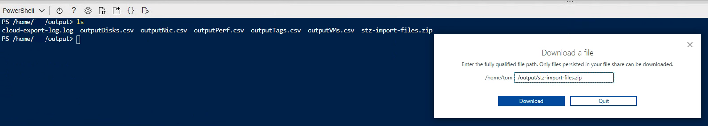

<!--
Copyright 2021 Google LLC

Licensed under the Apache License, Version 2.0 (the "License");
you may not use this file except in compliance with the License.
You may obtain a copy of the License at

     https://www.apache.org/licenses/LICENSE-2.0

Unless required by applicable law or agreed to in writing, software
distributed under the License is distributed on an "AS IS" BASIS,
WITHOUT WARRANTIES OR CONDITIONS OF ANY KIND, either express or implied.
See the License for the specific language governing permissions and
limitations under the License.
-->

# Solution Overview
This script collects information from provided Azure account and generates csv files for import into StratoZone for analysis.
Generated files will be placed in ./output directory and a compress zip file will be created that can be imported directly to StratoZone using the import procedure. 

**NOTE:** Script will collect data only on the instances user executing the script has access to. 


- [Solution Overview](#solution-overview)
- [StratoZone Azure export usage](#stratozone-azure-export-usage)
- [Prerequisites](#prerequisites)
- [Azure Permissions](#Azure-Permissions)
- [Support](#Support)
<!--
- [Optional Features & Configuration](#optional-features--configuration)
  - [Single Region as source(all VMs in project analyzed)](#single-project-analysis-all-vms-in-project-analyzed)
-->  

# StratoZone Azure Export Usage
- Step 1: Login to Azure Console (https://portal.azure.com)

- Step 2: Launch Cloud Shell \


- Step 3: Clone Script repo
```
git clone https://github.com/GoogleCloudPlatform/azure-to-stratozone-export.git
```

- Step 4: Access cloned project directory
```
cd azure-to-stratozone-export
```

- Step 5: Run script to start collection
```
./azure-export.ps1
```

- Step 6: Verify output file has been generated
```
 ls ./azure-import-files.zip
```

- Step 7: When the script completes, click on Upload/Download files icon.
 

 - Step 8: Enter the path to the output file.
 ```
 /azure-to-stratozone-export/azure-import-files.zip
```

 - Step 9: Click Download. File is ready for import into StratoZone portal.

 
# Prerequisites
  Azure Cloud Shell is the recommended environment to execute the collection script as it has all required components (PowerShell and Azure PowerShell module) already installed.

  If the script will be executed from a workstation following components will need to be installed
  - PowerShell 7.0.6 LTS, PowerShell 7.1.3, or higher 
  - Azure Az PowerShell module (https://docs.microsoft.com/en-us/powershell/azure/install-az-ps?view=azps-6.5.0)


# Azure Permissions
  The script needs read-only access to the Azure Subscriptions where collection will be performed.

# Support
If the execution of the script fails please contact stratozone-support@google.com and attach log file located in ./output directory.